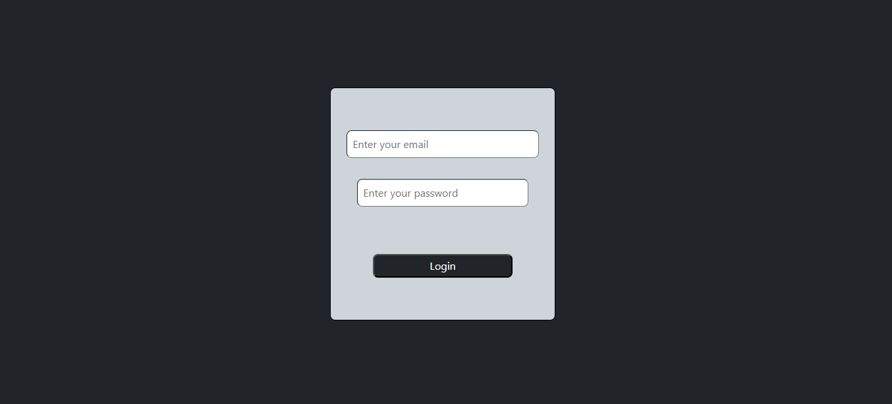

# 🏢 Task Management System – Admin & Employee Dashboard  

A **React-based Task Management System** where **Admins can create and assign tasks** to employees. Employees can log in using **Gmail authentication**, view their assigned tasks, and update their status.  

## 🚀 Features  
✅ **Authentication**: Employees can log in using **Gmail**  
✅ **Admin Panel**: Create, assign, and manage tasks  
✅ **Employee Dashboard**: View assigned tasks and update status  
✅ **Real-time Updates**: React-based UI with smooth state management  
✅ **Fully Responsive**: Works on desktop & mobile devices  

## 📸 Screenshot  
   

## 💻 How to Run?  
1. Clone the repository:  
   ```bash
   git clone https://github.com/SagarDevop/task-management-system.git

🌐 Live Demo
Live Demo Here (http://localhost:5173/)

🛠 Technologies Used
React.js – Frontend framework

Firebase Authentication – Google login for employees

Tailwind CSS – UI styling

React Router – Navigation between pages

Context API / Redux – State management

Firebase / MongoDB (if used for backend storage)

📌 Project Structure
csharp
Copy
Edit
task-management-system/
│── src/
│   ├── components/    # Reusable UI components
│   ├── pages/         # Admin & Employee dashboard
│   ├── context/       # State management (Context API / Redux)
│   ├── firebase.js    # Firebase authentication setup
│   ├── App.js         # Main component
│   ├── index.js       # React entry point
│── public/
│── README.md          # Project documentation
└── screenshot.png     # Preview image (optional)
🤝 Contributing
Want to improve this project? Feel free to fork, enhance features, or optimize the codebase!

📜 License
This project is open-source under the MIT License.
   

